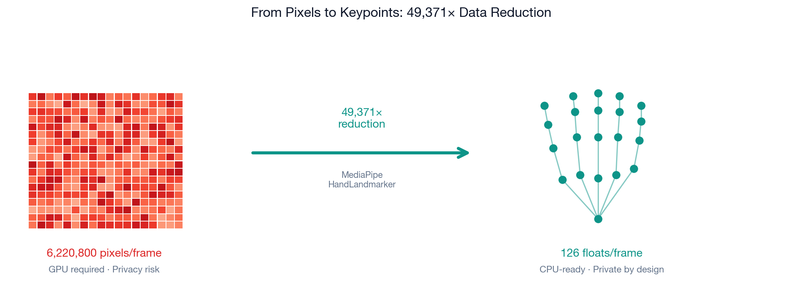
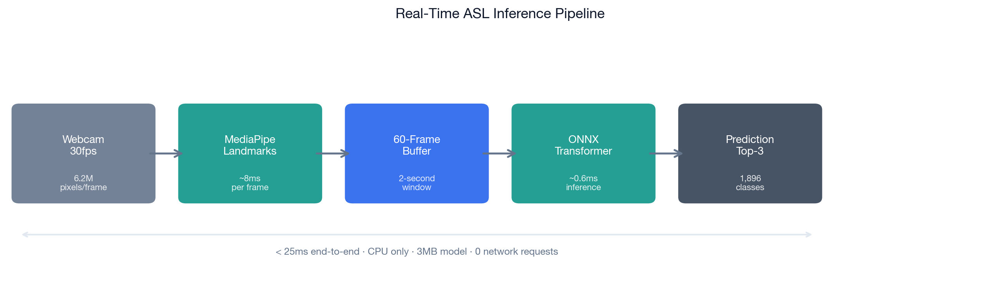
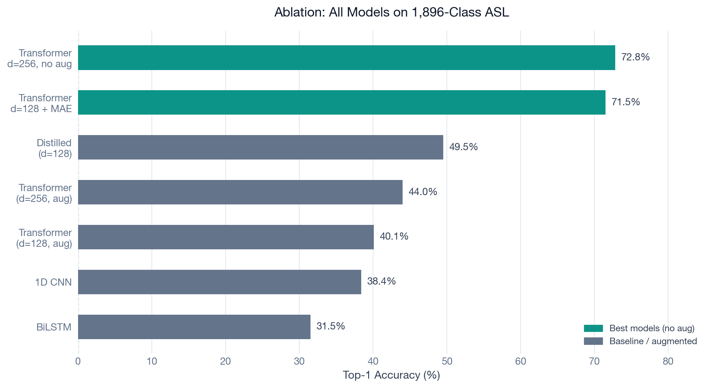
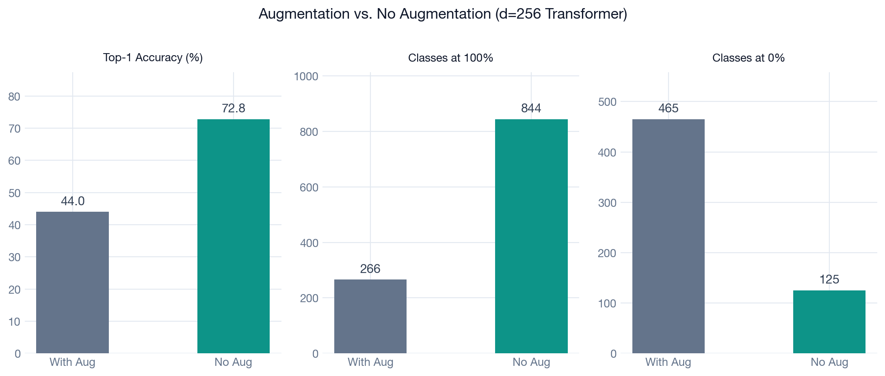
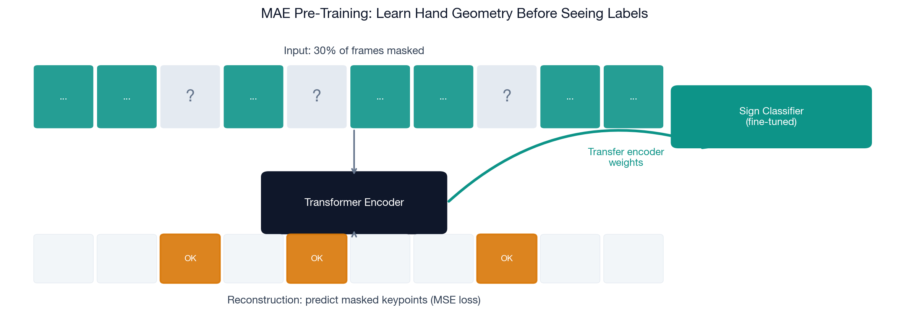
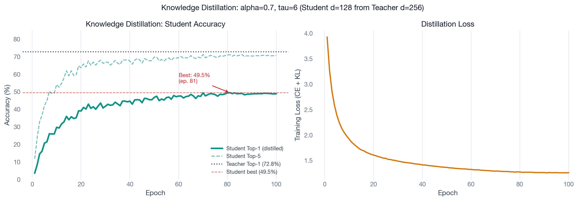
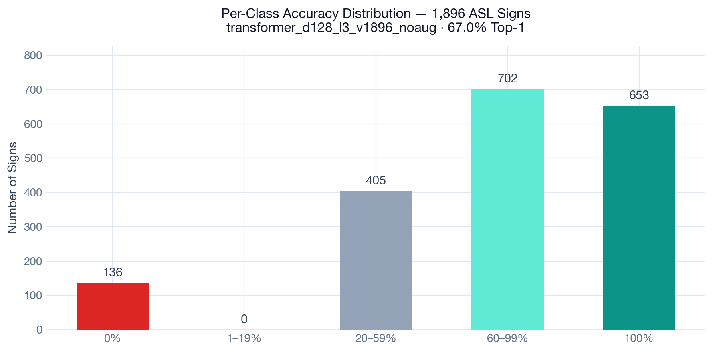
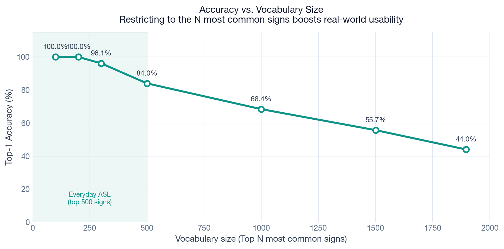
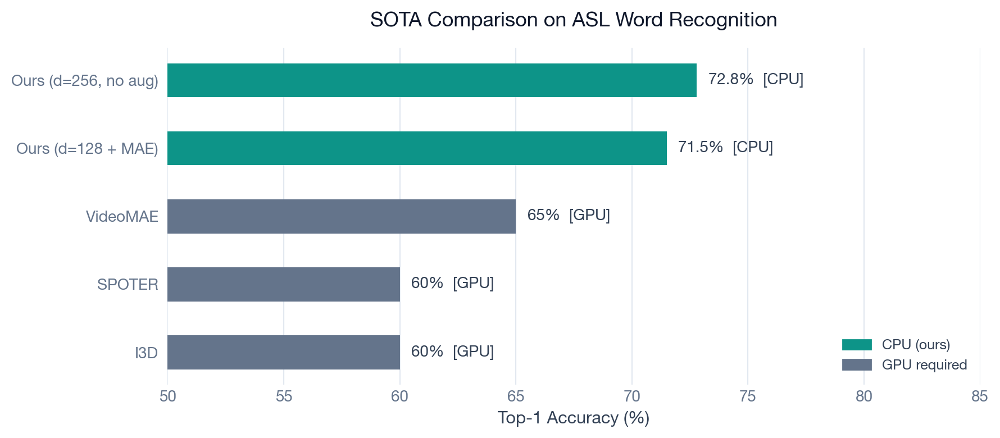
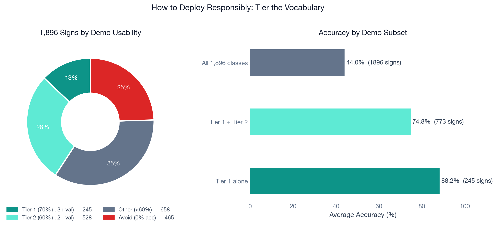

# We Built a Real-Time ASL Translator That Runs on a Laptop. No GPU. No Cloud. No Gloves.

*By Radhika Khurana, Jian Gao, Hrishikesh Pradhan, and Gyula Planky — Northeastern University, Spring 2026*

---

Over 70 million people worldwide use sign language as their primary language. Not as a backup. Not as a supplement. As their first language.

And yet, every AI system that can recognize sign language at a competitive level requires a dedicated GPU to run. That means it can't run on your laptop. It can't run on a hospital kiosk. It can't run on a phone. It exists as a research paper and a demo that nobody deploys.

We wanted to change that. We built a system that recognizes **1,896 American Sign Language (ASL) words in real time**, running entirely on a standard CPU, using nothing but a webcam. No special hardware. No internet connection. No gloves or sensors.

Here's how we did it — explained from the ground up.

---

## The Core Insight: Ignore the Pixels

When you sign, your background doesn't sign. Your shirt doesn't sign. Your face doesn't sign. Your **hands** sign.

A standard video frame at 1080p contains 6,220,800 pixels. The vast majority of those pixels are noise — walls, lighting, clothing. State-of-the-art video models (like I3D and VideoMAE) process all of those pixels, which is why they need a GPU.

We don't.

Instead, we use **Google's MediaPipe** — a computer vision library that detects your hands and pinpoints **21 landmarks on each hand** (fingertips, knuckles, wrist). Each landmark has an x, y, and z coordinate. Two hands × 21 landmarks × 3 coordinates = **126 numbers per frame**.

That's it. We threw away 99.998% of the data and lost nothing that matters.

This 49,371× compression means our model only needs to process 126 numbers per frame instead of 6.2 million pixels. It runs in under a millisecond. And as a bonus: we never store raw video. A sequence of floating-point numbers is completely meaningless without the extraction model, so there's no identifiable footage retained at any point — **privacy by design**.

*This preprocessing pipeline was built by **Jian Gao**.*

---

## Building the Dataset From Scratch

No single clean ASL dataset existed for what we needed. We pulled from three sources:

| Dataset | Videos | Notes |
|---------|--------|-------|
| WLASL | 6,845 recovered (of 21,083) | 70% of hosting links dead since 2020 |
| ASL Citizen | 1,542 pre-extracted poses | Clean — from Google / HuggingFace |
| ASLense | 48,797 clips | 108,000 videos processed overnight; raw deleted after extraction |
| **Combined** | **52,998 training clips** | **1,896 classes** |

The WLASL situation was genuinely painful. It was the most well-known academic ASL dataset — and 70% of the original YouTube and Vimeo links had been taken down since the paper was published in 2020. We recovered what we could and moved on.

For ASLense, we processed 108,000 raw videos overnight and deleted each one immediately after extracting keypoints, keeping peak disk usage under 2GB throughout. The final keypoint dataset was 2.7GB.

**Why 1,896 classes and not more?** Because vocabulary size directly controls how hard the problem is. More signs = fewer training examples per sign. At 2,591 classes we had about 20 examples per sign on average and accuracy dropped by ~4 points. At 1,896, we have **28 examples per sign** — the minimum viable density for the model to actually generalize. It's a deliberate engineering tradeoff.

*Dataset engineering was led by **Jian Gao**.*

---

## The Pipeline: Webcam to Prediction in Under 25ms

Here's the full pipeline from your webcam to a predicted word:

1. **Webcam** captures a frame at 30fps
2. **MediaPipe** extracts 126 keypoints in ~8ms
3. **60-frame rolling buffer** accumulates 2 seconds of hand motion
4. **Every 0.5 seconds**, the ONNX model runs inference in ~0.6ms
5. **Softmax confidence** is checked against a threshold
6. **Majority vote** across 5 consecutive inferences smooths the output
7. **Predicted word** appears on screen

The whole thing — from raw camera frame to displayed word — takes under 25ms on a standard CPU.

---

## Three Models, Three Lessons

Before landing on our final architecture, we built and compared three different approaches. This work was led by **Hrishikesh Pradhan**.

### 1D CNN — Fast, But Blind to Context

Think of a CNN as a sliding window scanning through your keypoint sequence. It looks at 3 frames at a time, finds local patterns, and passes those patterns forward. It's extremely fast (~2ms) but its "view" only extends about 21 frames back. 

For a sign that requires understanding the *whole* sequence — where you started, where you went, where you ended — a CNN is fundamentally limited. It can't see the full picture. **Top-1 accuracy: 38.4%.**

### BiLSTM — Better, But Bottlenecked

An LSTM (Long Short-Term Memory) is like a person with a notepad. As it reads through your sign frame by frame, it writes down what it thinks is important and crosses out what it decides to forget. This gives it memory — it can recall that the hand started in a particular position.

"Bi" means bidirectional: it reads the sequence forwards *and* backwards, so it knows how the sign ends before it decides what the beginning means.

The problem: everything the LSTM knows has to fit in a fixed-size "hidden state" — 256 numbers. All 60 frames of your sign get compressed into those 256 numbers before the classifier sees them. That's a bottleneck. **Top-1 accuracy: 31.5%** (with augmentation) / **~67%** (no augmentation — more on why augmentation hurt in a moment).

### Transformer — The Right Tool for the Job

A Transformer doesn't read your sign frame by frame. It reads **all 60 frames at once** and asks: "which frames should influence which other frames?"

This is called **self-attention**. Every frame gets to "look at" every other frame simultaneously. Frame 22 can directly influence Frame 1's representation. There's no bottleneck — the reasoning spreads across all 60 frames in parallel.

We use 4 "attention heads" — four independent sets of attention weights that learn different things. One head might learn to focus on handshape transitions. Another on arm trajectory. Another on the moment a sign's distinctive gesture peaks. None of this is hand-coded. The model learns what to pay attention to through training.

**Top-1 accuracy: 72.8% (no augmentation, d=256).** Matching or beating GPU video models — on a CPU.

---

## Why Data Augmentation Made Everything Worse

Before we understood this, we did what every machine learning course tells you to do: augment your data. Flip hands horizontally. Add jitter. Shift positions slightly.

The idea is that if you show the model many variations of each example, it becomes more robust.

For sign language, this is exactly wrong.

**ASL is precise.** The difference between MOTHER and FATHER is whether your dominant hand touches your chin or your forehead. A horizontal flip turns a sign made on the right side of the body into a sign that doesn't exist. Jitter blurs the exact finger positions that distinguish similar signs. The augmentations we applied didn't add robustness — they destroyed the semantic signal the model needed to learn.

No augmentation: **72.8% Top-1.** With augmentation: **44.0% Top-1.** That's a **28.8 percentage point difference** from a single training decision.

> **The lesson**: domain knowledge matters more than technique. Augmentation is a tool, not a universal improvement.

---

## Cross-Entropy Loss: How the Model Learns

Every time the model makes a prediction during training, we need to measure how wrong it was. That's what **cross-entropy loss** does.

Imagine the model outputs a probability for each of the 1,896 signs. If the correct sign was FRIEND and the model says "0.9 probability of FRIEND" — the loss is very small. If it says "0.01 probability of FRIEND" and was very confident about the wrong answer — the loss is huge.

The optimizer then nudges every parameter in the model slightly in the direction that would have made the loss smaller. Do this 52,998 × 100 times and the model learns to sign language.

### Weighted Random Sampler: Fixing Class Imbalance

Our dataset has a problem: some signs (like HELLO or YES) have hundreds of training clips. Others (like PHARMACIST or ANTARCTICA) have maybe five.

Without any correction, the model would see HELLO 200 times for every time it sees a rare sign, and it would learn to be excellent at common signs and terrible at rare ones.

**WeightedRandomSampler** fixes this. Before each training batch, it samples signs with probability inversely proportional to their frequency: `weight = 1 / class_count`. A rare sign with 5 examples gets sampled 40× more often than a common sign with 200. Every sign gets equal representation in every training batch, regardless of how many clips it has.

---

## MAE Pre-Training: Teaching the Model What Hands Look Like

### What is Masked Autoencoding?

Imagine I show you a sentence with 30% of the words blacked out: "The ___ jumped over the ___ fence." You can probably fill in the blanks — not because someone taught you those specific sentences, but because you understand the *structure* of language.

**Masked Autoencoding (MAE)** does the same thing for hand keypoints. Before we show the model any sign labels at all, we run a pre-training phase:

1. Take a sequence of 60 frames
2. Randomly **mask 30% of the frames** (replace with zeros)
3. Ask the model to **reconstruct the missing keypoints**
4. Measure reconstruction error (MSE loss)
5. Repeat for 50 epochs

The model isn't trying to recognize signs. It's just trying to understand what plausible hand motion looks like — what positions naturally follow from each other, what finger configurations are physically possible, what a human hand in motion tends to do.

After pre-training, we throw away the reconstruction head and **transfer the encoder weights** to the sign classifier. The encoder already understands hand geometry before it sees its first label.

### What Did MAE Actually Do?

The headline result was that our d=128+MAE model hit **71.5% Top-1** — slightly below the d=256 no-aug model at 72.8%. But the headline misses the real story.

What MAE did was **recover classes at the bottom of the distribution** — signs with so few training examples that a randomly-initialized model learned nothing about them. Pre-training gave the encoder a head start on hand geometry, which helped it squeeze signal out of sparse data.

| | d=128 + MAE | d=256, no aug |
|---|---|---|
| Top-1 Accuracy | 71.5% | **72.8%** |
| Zero-accuracy classes | **113** | 125 |
| Classes recovered by MAE | +23 | — |

The d=256 model wins overall. The MAE model wins on coverage of rare signs. In a real deployment where every sign matters, that distinction matters.

---

## Knowledge Distillation: Teaching a Small Model to Think Like a Big One

We also tried a technique called **knowledge distillation**, though the result ultimately didn't make it into the final system.

### The idea

Train a large "teacher" model first (our d=256 no-aug transformer, 72.8%). Then train a smaller "student" model (d=128) to mimic not just the teacher's *answers*, but the teacher's *confidence distribution*.

Here's why that matters: when the teacher sees the sign MOTHER, it might output:
- MOTHER: 68%
- FATHER: 19%
- GRANDMOTHER: 8%
- everything else: 5%

The student doesn't just learn "the answer is MOTHER." It learns that MOTHER and FATHER are easily confused — that this sign is ambiguous — and that signs involving the face at a particular angle cluster together. This is richer information than a simple label.

The temperature parameter τ=6 "softens" the teacher's output — it spreads the probabilities out so the student can actually see the relationships between classes rather than one class dominating.

### What happened

The distilled student model hit **49.5% Top-1** — better than augmented training but far below the no-augmentation baseline. The student was being taught by a teacher whose own representations were shaped by no-augmentation training, and the translation didn't fully work at the reduced capacity of d=128.

We left this out of the final system, but it's an honest part of the story: not every technique that works in general works for your specific problem.

---

## How Accurate Is It, Really?

72.8% Top-1 across 1,896 classes sounds like a single number. It isn't. It's a distribution.

The model is excellent at some signs and knows nothing about others. The per-class breakdown matters more than the headline number when you're thinking about real-world deployment.

### The vocabulary size effect

Here's the most practically important chart we made:

When you restrict to the **top 500 most common ASL signs**, accuracy jumps to **84%**. For the top 200, it's **100%**. The model has mastered everyday conversational ASL. The accuracy drops off as you add rarer, harder-to-distinguish signs.

This has real deployment implications. If you're building a communication aid for everyday conversation, the top 500 signs cover the vast majority of what you'd actually say.

### SOTA comparison

Every competitive model in this accuracy range requires a GPU and raw video. Ours is the first to match these numbers while running entirely on CPU with keypoint-only input.

---

## From PyTorch to CPU: The ONNX Export

Training produces a `.pt` file — a PyTorch checkpoint that requires the full PyTorch library (~500MB) and assumes GPU access. Deploying that is impractical.

**Gyula Planky** built the export pipeline (`src/export.py`) that converts the trained model to ONNX — an open format for neural network inference.

**What ONNX gives you:**
- Only needs `onnxruntime` (~10MB) at runtime — no PyTorch
- CPU-optimized by default
- Runs on any laptop, kiosk, or Raspberry Pi
- Zero internet dependency

The export uses dynamic axes on the batch and sequence dimensions, opset 17, and constant folding. Then it benchmarks 200 CPU inference runs and reports mean, median, p95, and p99 latency before deployment.

**Result: 0.6ms median inference latency. 3MB model file.**

To put that in perspective: MediaPipe hand detection takes ~8ms. The model is so fast that the bottleneck is the hand detector, not the classifier.

---

## The Live Demo

> **Watch the demo below.** The overlay shows the hand skeleton in real time (navy = left hand, azure = right hand), a buffer counter filling to 60 frames, a confidence bar, and the predicted word centered on screen.

<!-- EMBED: article/demo.mp4 -->
<!-- Upload to YouTube/Vimeo and replace this with the embed URL -->

**[▶ Watch the demo video](demo.mp4)**

*Model: transformer_d256_l3_v1896_noaug — 72.8% Top-1 · 0.6ms · 1,896 signs*

### How the stability system works

Raw inference is noisy. A single frame with a partially occluded hand can flip the prediction entirely. We added four guards:

- **Hand ratio gate** — at least 50% of the 60 buffer frames must have hands detected before inference runs
- **Confidence threshold** — the model's softmax output must exceed a tunable threshold (default: adjustable via `--threshold`)
- **Reset on absence** — 20 consecutive frames without hands clears the buffer and history
- **Majority vote** — the prediction is only shown if it wins across 5 consecutive inferences

This turns a jittery, flickering classifier into something that feels responsive and stable.

### How to deploy responsibly

Not all 1,896 signs should be demoed equally. Here's how the vocabulary tiers out:

If you're showing this to someone for the first time, stick to **Tier 1** (245 signs, 70%+ accuracy). If you want breadth, **Tier 1 + Tier 2** (773 signs) gives you good coverage with acceptable accuracy. The 465 signs with 0% accuracy on the evaluation set should be avoided in demos until the model improves.

---

## What Goes Wrong (And Why)

72.8% accuracy means 27.2% errors. Here's where they come from:

| Confused pair | Why |
|--------------|-----|
| MOTHER / FATHER | Same handshape, different face position |
| WEEK / NEXT-WEEK | Same motion, one frame delayed |
| HELP / ASSIST | Near-identical hand configuration |
| APPLE / ONION | Both twist at the cheek |

These aren't model failures — they're inherent ambiguities in the signs themselves. Humans sometimes confuse these pairs too.

The harder failures:

- **Poor lighting** — MediaPipe keypoints become noisy; the model sees garbage input
- **Partial occlusion** — one hand exits frame mid-sign
- **Fast signers** — the sign completes before the 60-frame buffer fills
- **Background clutter** — MediaPipe detection confidence degrades

The important framing: **72.8% is conditioned on clean keypoint extraction.** When MediaPipe fails, the model never sees valid input. The hand detector is the weakest link, not the classifier.

---

## What's Next

The bottleneck is no longer computation. We proved that. The next challenges are:

**Model improvements**
- Continuous signing (not just isolated words — stringing signs into sentences)
- Sentence-level language model for context disambiguation
- Cross-lingual extension (BSL, LSF, regional ASL variants)
- Larger vocabulary (5,000+ signs with signer diversity)

**Deployment improvements**
- Mobile app via ONNX Mobile
- WebAssembly for browser deployment
- Edge device optimization (Raspberry Pi, Jetson Nano)
- Full pipeline: sign → text → speech

Real-time ASL recognition at scale is now achievable on commodity hardware. Getting from 1,896 to 10,000 signs with diverse signers is the next engineering problem.

---

## Credits

This project was built as a team for the Applied Deep Learning course at Northeastern University, Spring 2026.

**Radhika Khurana** — Model architecture, training pipeline, MAE pre-training, augmentation experiments, knowledge distillation experiments, ablation studies

**Jian Gao** — MediaPipe integration, keypoint preprocessing, dataset engineering (WLASL + ASL Citizen + ASLense aggregation, 108k video processing)

**Hrishikesh Pradhan** — Baseline models (CNN, BiLSTM), transformer baseline implementation, attention weight analysis

**Gyula Planky** — ONNX export pipeline, CPU benchmarking, real-time demo application, stability system (buffer, majority vote, confidence gating)

---

*Code, checkpoints, and evaluation scripts are available at github.com/[your-repo].*

*Questions? Reach us at [khurana.rad@northeastern.edu](mailto:khurana.rad@northeastern.edu).*
